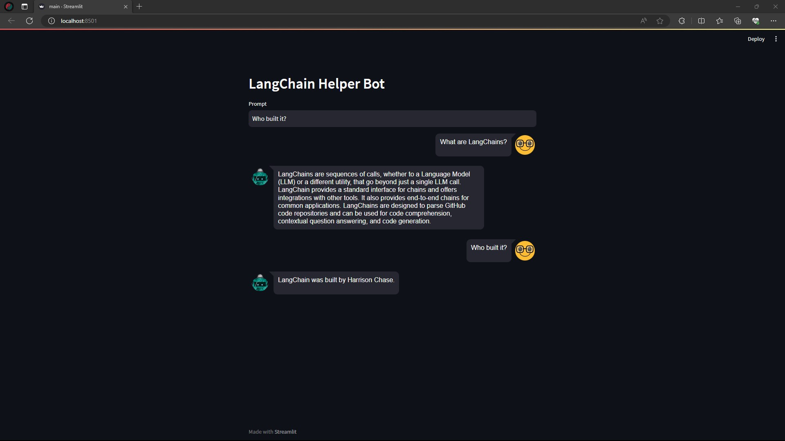

# __LangChain Documentation Helper__

This LangChain based AI Web Application that is trained and deployed to answer ay question about LangChain (Sources from Official LangChain documentation).



The application uses a combination of OpenAI's ChatGPT as an LLM with the Pinecone vector database to retrieve and present relevant information about any question related to LangChain.


## Implementation

Clone the project

```bash
git clone https://github.com/maxlr8/langchain_documentation_helper.git
```

Create accounts in the OpenAI and Pinecone and save the API keys in the __.env file__ below

#### __[Environment File](./backend/.env)__ 

<br>

Go to the project directory

```bash
  cd langchain_documentation_helper
```

Install all the dependencies

```bash
  pip install requirements.txt
```

Run the __Streamlit App__

```bash
  streamlit run main.py
```
